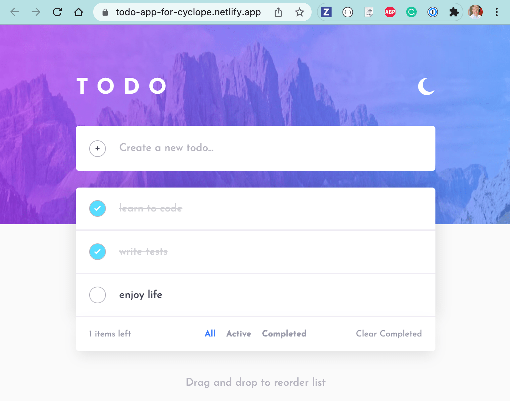

# todo-app-for-cyclope
> This is a single vanilla JavaScript TodoApp to showcase [cyclope plugin](https://github.com/bahmutov/cyclope)

This is a single vanilla js TodoApp used for testing. It was taken from [https://github.com/hariramjp777/frontend-todo-app/](https://github.com/hariramjp777/frontend-todo-app/). Deployed to [https://todo-app-for-cyclope.netlify.app/](https://todo-app-for-cyclope.netlify.app/).
